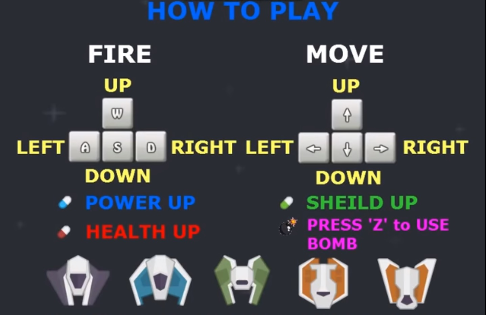

# DodgeGame

### 팀 구성
: 양지용, 신태욱, 연제원

### 역할 분담
양지용 : 보스 구현 및 공격 패턴 구현, 아이템 구현  
신태욱 : 플레이어 움직임 및 아이템, 이펙트 구현  
연제원 : 통합 및 디자인  

### 게임 설명
1. 사방에서 나오는 적기와 해당 적기들이 발사하는 총알을 피하고, 위에서 떨어지는 운석, 일정 
시간 지난 뒤 나타나는 유도형 총알을 피하는 게임입니다.

2. 이에 네 방향으로 이동할 수 있고, 네 방향으로 모두 공격이 가능합니다. 적기체는 공격하여 
없앨 수 있으며, 점수 또한 얻을 수 있습니다.

3. 적기체의 경우 3가지의 패턴을 지니며, 아이템은 체력증가/파워증가/쉴드생성 3가지를 
만들었습니다.

    3.1. 추가적으로 점수 2000점 당 폭탄 아이템 1개씩을 지급하며, 폭탄 아이템은 사용시 전지역의 
적개체, 총알을 삭제하게됩니다.

4. 0~100초 까지 20초를 단위로 난이도의 증가를 삽입하였고, 100초를 버텼을 경우에는 보스로 
진입을 하게 됩니다.

5. 보스의 경우 4가지의 패턴을 지니고 있으며, 보스기체 명중에 따라 점수를 얻어 폭탄 아이템 
또한 얻을 수 있도록 구현하였습니다.

6. 만일 죽거나, 클리어를 하게된다면 얻은 점수와 버틴 시간을 보여주게됩니다.

### 게임 조작 방법

### 게임 시연 영상

